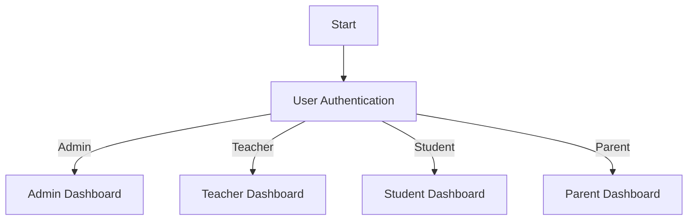
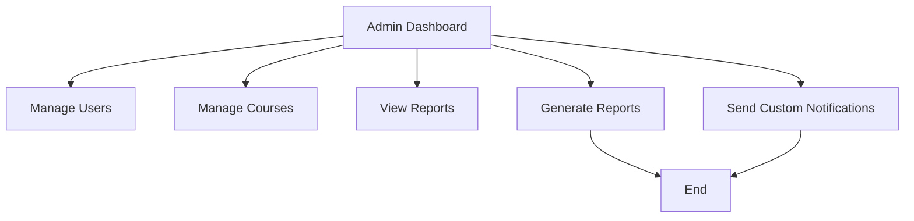
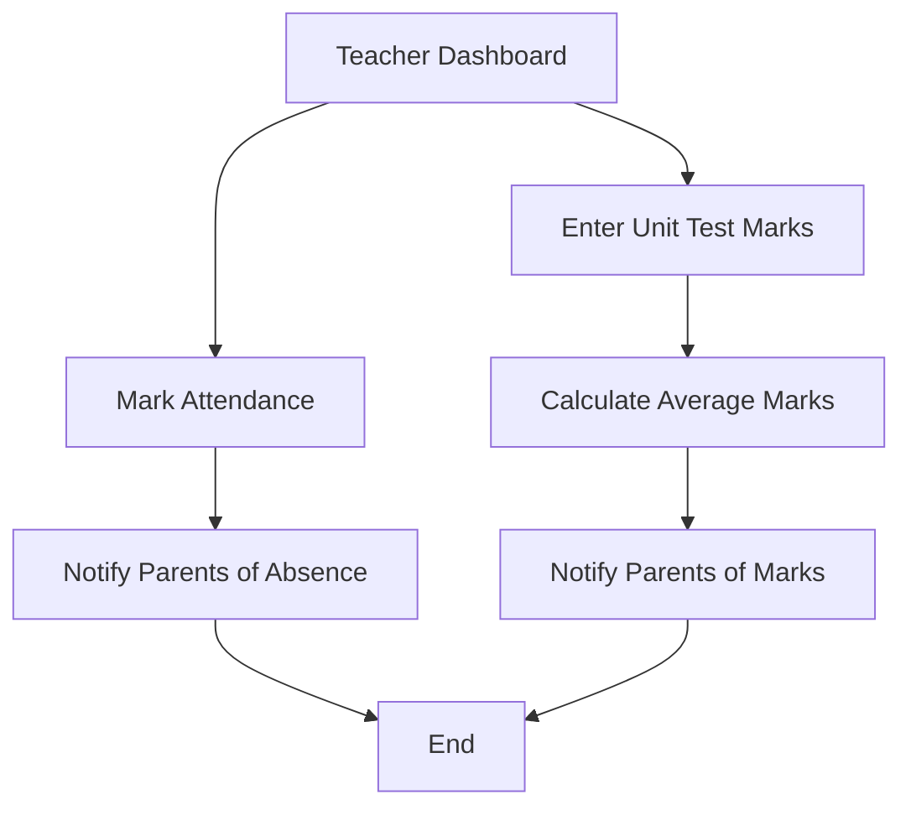
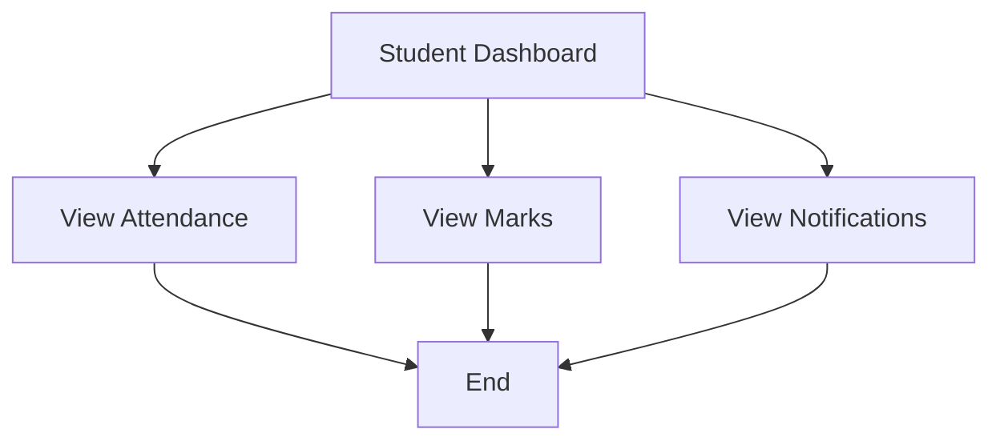
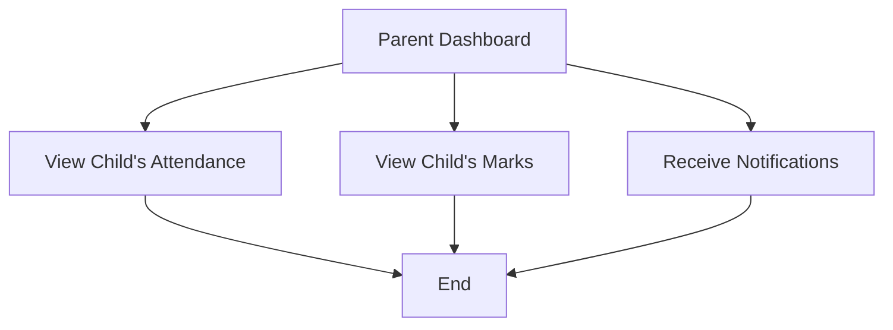
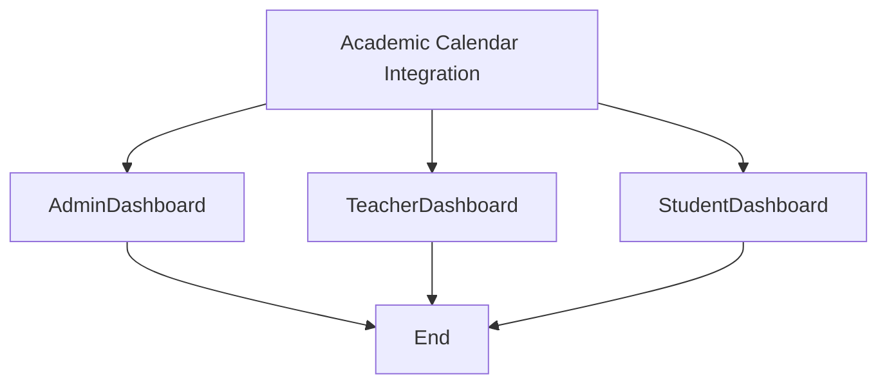

### Project Scope: Department Management System

**1. User Roles and Authentication**
   - **Admin**: Manages the entire system, including adding new students, teachers, and managing courses.
   - **Teachers**: Manage class attendance, unit test marks, and communicate with students and parents.
   - **Students**: View their attendance, test marks, and receive notifications.
   - **Parents**: View their child's attendance and test marks, and receive notifications.

**2. Auto Attendance System**
   - **Attendance Marking**: Teachers can mark attendance via a web interface or integrate with an auto-attendance system (like RFID or facial recognition).
   - **Notification to Parents**: Automatically send SMS or email notifications to parents if a student is absent from the class. You can use third-party APIs like Twilio for SMS or SendGrid for emails.
   - **Daily Attendance Report**: Generate daily attendance reports for each class or department.

**3. Unit Test Marks Management**
   - **Marks Entry**: Teachers enter unit test marks for students in each subject.
   - **Average Calculation**: Automatically calculate the average of Unit Test 1 and Unit Test 2 marks.
   - **Notification to Parents**: Send the calculated average marks to parents via SMS or email.

**4. Academic Calendar Integration**
   - **Calendar Sync**: Integrate with the academic calendar to send reminders and notifications to teachers about entering marks or taking attendance.
   - **Exam and Assignment Scheduling**: Display upcoming unit tests, exams, and assignment due dates.

**5. Dashboard and Reporting**
   - **Admin Dashboard**: Provides an overview of attendance stats, test scores, and other key metrics.
   - **Teacher Dashboard**: Shows a summary of their classes, attendance records, and test scores.
   - **Student Dashboard**: Shows personal attendance records, test scores, and notifications.
   - **Parent Dashboard**: Allows parents to view their child's performance and receive notifications.

**6. Notifications and Alerts**
   - **Custom Notifications**: Teachers and admins can send custom notifications to students or parents.
   - **Automated Alerts**: Triggered based on predefined rules (e.g., attendance below a certain threshold).

**7. Additional Features**
   - **Performance Analytics**: Basic analytics to identify trends in student performance and attendance.
   - **Feedback System**: A feature for parents and students to provide feedback or raise concerns.
   - **Secure Data Handling**: Ensure all sensitive data, such as marks and contact information, is securely stored and transmitted.

**8. Technical Requirements**
   - **Front-End**: HTML, CSS, JavaScript (React.js or Vue.js)
   - **Back-End**: Node.js with Express or Python with Django/Flask
   - **Database**: MongoDB, MySQL, or PostgreSQL
   - **APIs for Notifications**: Twilio (SMS), SendGrid (Email)
   - **Authentication**: JWT (JSON Web Tokens) or OAuth

**9. Deployment and Maintenance**
   - Deploy on a cloud platform like AWS, Azure, or Heroku.
   - Set up regular backups and maintenance schedules.

## Flowchart

### 1. **User Authentication Flowchart**

### 2. **Admin Dashboard Flowchart**

### 3. **Teacher Dashboard Flowchart**

### 4. **Student Dashboard Flowchart**

### 5. **Parent Dashboard Flowchart**

### 6. **Academic Calendar Integration Flowchart**

### Conclusion

This scope gives a structured approach to building your department management system. It covers essential features like auto attendance, unit test marks management, and notifications while allowing room for future expansion. Start with the core functionalities and build incrementally to ensure a smooth development process.
